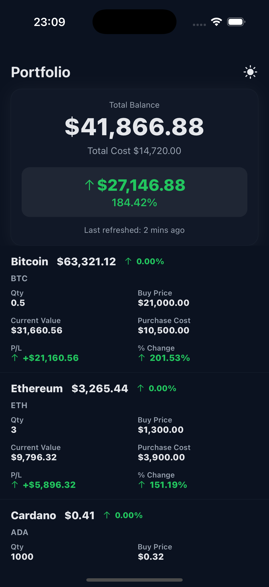
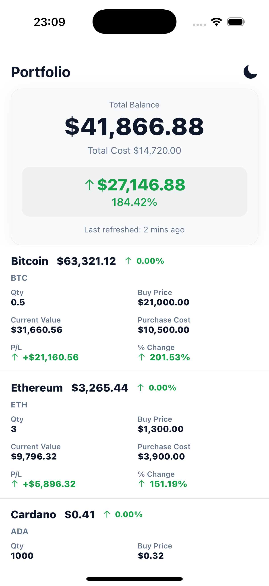
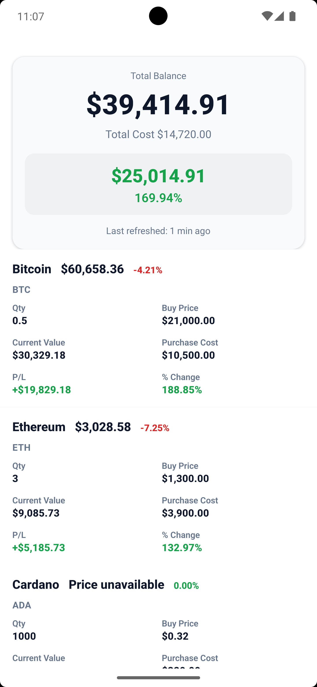

# CryptoPortfolio

Single-screen crypto portfolio demo with mocked data, loading/error/partial states, dark/light theme toggle, and pull-to-refresh.
Runs in **Expo Go** (no native build needed). Tests via **Jest** + **jest-expo** + **@testing-library/react-native**.

---

## Quick Start

**Prereqs:** Node ≥ 18, npm ≥ 9, Expo Go on your phone.

```bash
npm install
npm run start
```

Open the QR in Expo Go on your device
(or use npm run ios / npm run android if you have simulators).

## Testing

```bash
npm run test
```

## Demo

<p align="center">
   
  
  
</p>

<p align="center">
  
  
</p>
